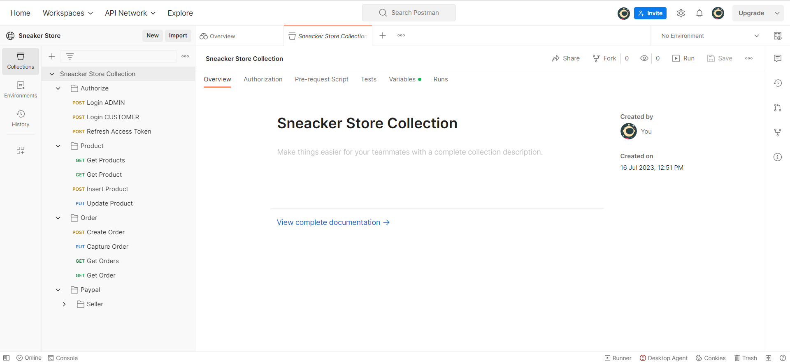

# SneakerStore

API cho trang web thương mại điện tử, với các chức năng chính, tạo product, order và thực hiện thanh toán.

Sử dụng **Spring boot**, **JPA**, **Spring Security** + **JWT**, **AOP**, **Paypal**

Link [@Postman](https://www.postman.com/planetary-desert-10407/workspace/sneaker-store/collection/14981914-7c1e3d18-cc67-4d0a-b7fc-011a40742d7c?action=share&creator=14981914) để test API.

